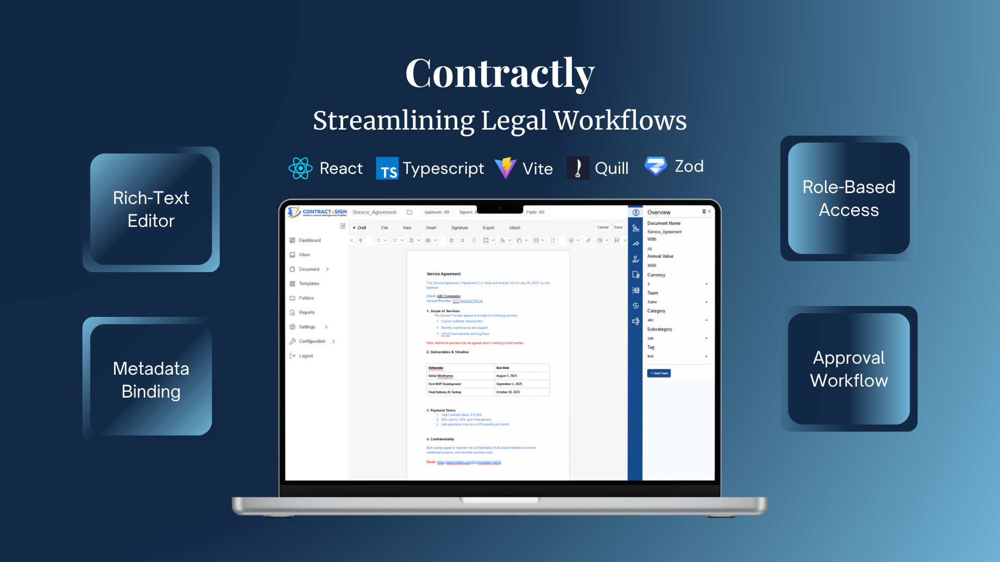

<div align="center">
  
</div>

# Contractly

**Streamlining Legal Workflows**

Contractly is a full-featured Contract Lifecycle Management (CLM) platform engineered to streamline complex legal workflows through a modular and scalable architecture.

At its core lies a highly customized, ReactQuill-powered document editor that replicates the editing fidelity of Microsoft Word and Google Docs within the browser. It supports:

- Native-style **pagination**
- **Semantic formatting**
- **Dynamic page breaks**
- Delta-based **diffing** for precise content manipulation

### 🔐 Key Features

- 🔒 **Role-Based Access Control (RBAC)**
- ✅ **Multi-stage approval pipelines**
- 📄 **Metadata-bound rendering** for dynamic contract templating
- 📁 Seamless **collaborative drafting**, reviewing, and approval

### ⚙️ Tech Stack

- **React**, **TypeScript**, **Vite**
- **Material UI**, **Zod**, **Axios**
- **ReactQuill** (heavily customized)

---

## 🚀 Getting Started

### 1. Clone the repository

```bash
git clone https://github.com/your-username/contractly.git
cd contractly
```

### 2. Install Dependencies
```bash
npm install
# or
yarn
```

### 3. Start Development Server
```bash
npm run dev
# or
yarn dev
```

### 4. Build for Production
```bash
npm run build
# or
yarn build
```

## 📂 Folder Structure
```
contractly
├── public/ # Static assets
├── node_modules/ # Installed dependencies
├── src/
│ ├── assets/ # Images, fonts, etc.
│ ├── components/ # Reusable UI components
│ ├── context/ # React context providers
│ ├── hooks/ # Custom React hooks
│ ├── pages/ # App pages and routes
│ ├── services/ # API interaction logic
│ ├── utils/ # Utility functions & helpers
│ ├── app.tsx # Main App component
│ ├── app.css # Global styles
│ ├── index.css # Entry-point CSS
│ └── main.tsx # App entry point
```

## 📧 Contact
For questions, feedback, or collaboration proposals:
  📮 m.muntazer.mehdi@gmail.com
